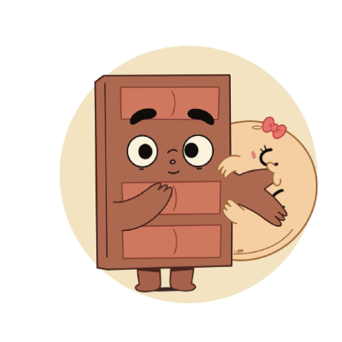

# 🍫 Choco and Pancake

<figure><figcaption>
Choco &#x26; Pancake
</figcaption></figure>

$CHOCOPAN is a crypto memecoin built on the Ethereum mainnet. It draws its inspiration from the charming Instagram couple Choco and Pancake, whose heartwarming and delightful moments have warmed the hearts of million followers.

Chocopan is the sweet reminder that even in the world of digital finance, there's always room for a touch of cuteness and levity.

Let Chocopan show the way as it seeks to capture the hearts and wallets of meme-loving investors.

Contract address : 0xa0d54c9ff19a5e9aa358345eb015bea7767b4456
